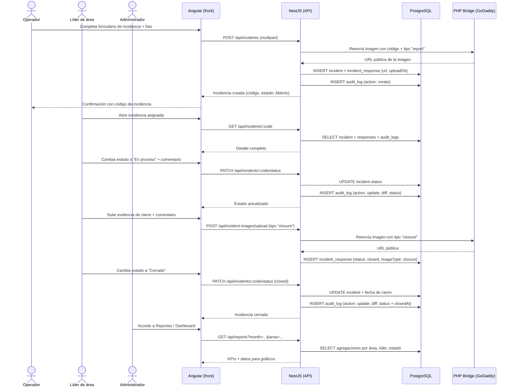
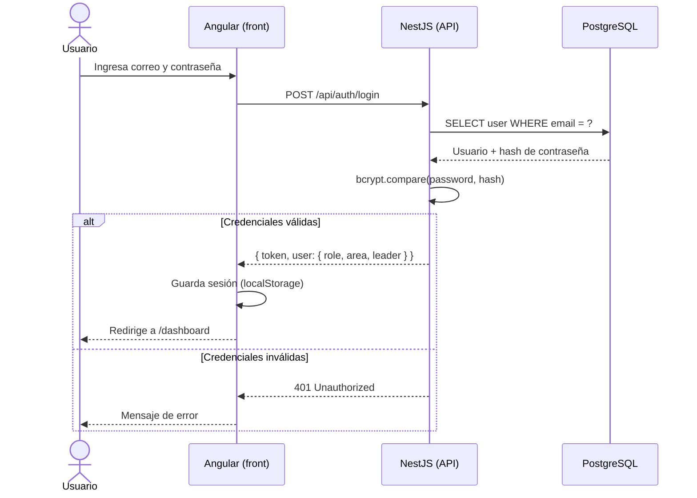
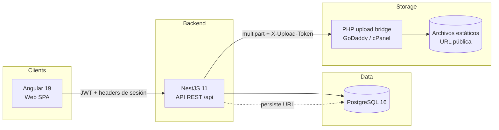

# Issue Tracking — Incidencias y condiciones inseguras

Aplicación web para el **registro, control y seguimiento de incidencias, actos y condiciones inseguras** en operaciones industriales/agrícolas. Sustituye el flujo basado en Excel por un proceso ordenado con trazabilidad completa, evidencia fotográfica y reportes por rol.

---

## Tabla de contenidos

1. [¿Qué hace el sistema?](#qué-hace-el-sistema)
2. [Roles y permisos](#roles-y-permisos)
3. [Flujo principal — diagrama de secuencia](#flujo-principal--diagrama-de-secuencia)
4. [Módulos implementados](#módulos-implementados)
5. [Pantallas disponibles](#pantallas-disponibles)
6. [Usuarios de prueba](#usuarios-de-prueba)
7. [Arquitectura técnica](#arquitectura-técnica)
8. [Estructura del repositorio](#estructura-del-repositorio)
9. [Levantar con Docker](#levantar-con-docker)
10. [Desarrollo local sin Docker](#desarrollo-local-sin-docker)
11. [Deploy en Railway](#deploy-en-railway)
12. [Bridge PHP para imágenes (GoDaddy)](#bridge-php-para-imágenes-godaddy)
13. [Variables de entorno](#variables-de-entorno)
14. [Changelog](#changelog)

---

## ¿Qué hace el sistema?

El sistema cubre el ciclo completo de una incidencia operativa:

**Registro** → **Asignación de responsable** → **Seguimiento** → **Cambio de estado** → **Cierre con evidencia** → **Reportes e indicadores**

### Problema que resuelve

| Antes (Excel) | Ahora |
|---|---|
| Duplicidad de datos y dependencia de macros | Registro único con validaciones |
| Reportes manuales y sin trazabilidad | Auditoría automática de cada cambio |
| Evidencias fotográficas difíciles de gestionar | Imágenes vinculadas por incidencia y estado |
| Sin control de acceso por usuario | Roles con scope automático (líder solo ve su área) |
| Poca visibilidad de qué está abierto o cerrado | Dashboard con KPIs en tiempo real |

### Estados de una incidencia

```
Abierto  ──►  En proceso  ──►  Cerrado
```

- **Abierto:** registrada, sin atención aún.
- **En proceso:** el responsable inició acciones correctivas.
- **Cerrado:** acción correctiva ejecutada y validada (fecha, usuario, comentario y evidencia fotográfica opcional).

---

## Roles y permisos

| Rol | Alcance | Capacidades principales |
|---|---|---|
| **Administrador** | Todo | CRUD completo, gestión de usuarios, reportes globales, auditoría |
| **Líder de área** | Su área | Dashboard propio, cambio de estado, acciones correctivas, reporte mensual |
| **Operador / reportante** | Sus registros | Registrar incidencias con foto, consultar estado de atención |
| **Auditor** | Solo lectura | Consulta y auditoría |

---

## Flujo principal — diagrama de secuencia

### Registro y cierre de una incidencia



### Autenticación



---

## Módulos implementados

| Módulo | Estado | Descripción |
|---|---|---|
| Autenticación | ✅ | Login con JWT, guard por rol, interceptor de sesión |
| Dashboard | ✅ | KPIs globales (admin) y por área (líder) |
| Incidencias | ✅ | Listado con filtros, registro, edición, cambio de estado |
| Evidencia fotográfica | ✅ | Subida de imágenes por incidencia y tipo (report/closure) |
| Organización | ✅ | Gestión de usuarios, áreas, líderes y roles |
| Maestros | ✅ | Catálogo de ítems configurables |
| Reportes | ✅ | Filtros por mes/año/área/líder/estado, exportación Excel y PDF |
| Auditoría | ✅ | Historial completo de cambios con diff y snapshot anterior |
| Cambio de contraseña | ✅ | Pantalla de cuenta para todos los roles |

---

## Pantallas disponibles

| Ruta | Componente | Acceso |
|---|---|---|
| `/login` | Login | Público |
| `/dashboard` | Dashboard general / por líder | Todos los roles |
| `/incidents` | Listado de incidencias | Todos los roles |
| `/incidents/:code` | Detalle / edición de incidencia | Según rol |
| `/organizacion` | Usuarios, áreas, líderes, roles | Admin |
| `/maestros` | Catálogos | Admin |
| `/reports` | Reportes e indicadores | Admin / Líder |
| `/auditoria` | Log de auditoría | Admin |
| `/account/password` | Cambio de contraseña | Todos los roles |

---

## Usuarios de prueba

La semilla local crea estos usuarios. En Docker se cargan con `SEED_ON_BOOT=true`.

| Rol | Correo | Contraseña | Alcance |
|---|---|---|---|
| Administrador | `admin@demo.local` | `demo1234` | Ve toda la operación |
| Líder demo | `lider@demo.local` | `demo1234` | Área `PACK`, líder `LUCIA` |
| Operador demo | `operador@demo.local` | `demo1234` | Área `FIELD`, líder `MARIO` |
| Líder Empaque | `lucia@demo.local` | `demo1234` | Área `PACK` |
| Líder Campo | `mario@demo.local` | `demo1234` | Área `FIELD` |
| Líder Planta | `rosa@demo.local` | `demo1234` | Área `PLANT` |
| Líder Logística | `manuel@demo.local` | `demo1234` | Área `LOG` |
| Líder Calidad | `diana@demo.local` | `demo1234` | Área `QA` |
| Auditor | `auditor@demo.local` | `demo1234` | Solo consulta |

> En ambientes reales cambia estas contraseñas desde la pantalla **Cuenta → Clave** y desactiva las credenciales demo.

---

## Arquitectura técnica

### Stack

| Capa | Tecnología | Versión |
|---|---|---|
| Frontend | Angular standalone | 19 |
| Backend | NestJS + TypeORM | 11 |
| Base de datos | PostgreSQL | 16 |
| Contenedores | Docker Compose + nginx | — |
| Exportación | ExcelJS + PDFKit | — |
| Imágenes | PHP bridge (GoDaddy) | — |

### Diagrama de contexto



### Modelo de datos principal

| Tabla | Descripción |
|---|---|
| `users` | Usuarios con rol, área y líder asociado |
| `roles` | Roles del sistema |
| `areas` | Áreas operativas |
| `leaders` | Líderes de área |
| `incidents` | Incidencias con estado, potencial, responsable |
| `incident_responses` | Imágenes y respuestas por estado (report / closure) |
| `audit_logs` | Historial completo: snapshot anterior + diff por cambio |
| `catalog_items` | Catálogo configurable de ítems |
| `work_sites` | Fundos / plantas / sedes |

### Auditoría y trazabilidad

Cada operación de creación, actualización o eliminación genera un registro en `audit_logs` con:

- `entityType` / `entityId`: qué objeto cambió.
- `action`: `create` | `update` | `delete`.
- `changeLabel` + `previousValue` + `nextValue`: resumen del cambio (ej. `status: open → in_progress`).
- `changedBy`: email del usuario (desde header `x-user-email`).
- `previousSnapshot`: objeto completo antes del cambio (JSON).
- `diff`: solo los campos que cambiaron `{ campo: { from, to } }` (JSON).

### KPIs por rol

El dashboard y los reportes aplican scope automático desde los headers de sesión `x-role-code`, `x-area-code` y `x-leader-code`. El líder solo ve su área; el administrador ve todo.

---

## Estructura del repositorio

```text
issue-tracking/
├── apps/
│   ├── front/              # Angular 19 — SPA (ver ARCHITECTURE.md)
│   │   └── src/app/
│   │       ├── core/       # guards, interceptors, servicios base
│   │       ├── features/   # páginas por dominio
│   │       ├── layout/     # app-shell (nav + sidebar)
│   │       └── shared/     # utilidades compartidas
│   └── back/               # NestJS 11 — API /api (ver ARCHITECTURE.md)
│       └── src/app/
│           ├── controller/ # controladores REST
│           ├── service/    # lógica de negocio
│           ├── entity/     # entidades TypeORM
│           ├── mapper/     # transformación DTO ↔ entidad
│           └── module/     # módulos NestJS por dominio
├── godaddy-php/            # PHP bridge: upload.php + config
├── scripts/                # deploy-godaddy-php.ps1
├── .github/workflows/      # CI/CD: deploy-godaddy-php.yml
├── infra/                  # docker-compose.yml + overrides
├── docs/                   # documentación adicional
├── .env.example            # secretos GoDaddy / FTP (raíz)
└── README.md
```

---

## Levantar con Docker

Requiere Docker Desktop (o Docker Engine + Compose v2).

```powershell
# 1. Copiar variables de entorno
Copy-Item infra\.env.example infra\.env

# 2. Ajustar contraseñas en infra/.env si lo deseas

# 3. Levantar todo (Postgres + API + Angular via nginx)
docker compose -f infra/docker-compose.yml --env-file infra/.env up --build
```

| Servicio | URL |
|---|---|
| Angular UI | http://localhost:8080 |
| API directa | http://localhost:3001/api/health |
| Swagger | http://localhost:3001/api-docs |

Para cargar la semilla de datos demo, agrega `SEED_ON_BOOT=true` en `infra/.env` antes de levantar.

Para exponer PostgreSQL al host (herramientas externas):

```powershell
docker compose -f infra/docker-compose.yml -f infra/docker-compose.host-postgres.yml --env-file infra/.env up -d
```

Ver detalles en [infra/README.md](./infra/README.md).

---

## Desarrollo local sin Docker

```powershell
# Solo Postgres en Docker
docker compose -f infra/docker-compose.yml --env-file infra/.env up -d postgres

# Backend
Copy-Item apps/back/.env.example apps/back/.env   # ajusta DATABASE_HOST=localhost
cd apps/back
npm install
npm run start:dev

# Frontend (en otra terminal)
cd apps/front
npm install
npm start   # proxy a http://localhost:3000 via proxy.conf.json
```

---

## Deploy en Railway

1. Crea un proyecto en Railway y agrega un servicio **Postgres**.
2. Agrega un servicio desde GitHub con **Root Directory** = `apps/back`.
3. Railway detecta `apps/back/railway.toml` y arranca con `npm run start:prod`.
4. Configura las variables del servicio API:

```
NODE_ENV=production
DATABASE_URL=${{Postgres.DATABASE_URL}}
TYPEORM_SYNC=false
SEED_ON_BOOT=false
CORS_ORIGIN=https://<tu-frontend>.up.railway.app
GODADDY_PHP_UPLOAD_URL=https://tudominio.com/incidencias-uploads/upload.php
GODADDY_UPLOAD_SECRET=<mismo valor de godaddy-php/config.php>
```

5. Valida:
   - `https://<tu-api>.up.railway.app/api/health`
   - `https://<tu-api>.up.railway.app/api-docs`

> El backend acepta `DATABASE_URL` (recomendado en Railway) y también variables separadas (`DATABASE_HOST`, `DATABASE_PORT`, etc.).

---

## Bridge PHP para imágenes (GoDaddy)

Las imágenes se almacenan en hosting compartido (GoDaddy/cPanel) a través de un bridge PHP mínimo.

**Flujo:** Angular → NestJS (JWT) → `POST /api/incident-images/upload` → Nest reenvía al PHP con `codigo_incidencia`, `tipo_imagen` y cabecera `X-Upload-Token`. El PHP escribe el archivo y devuelve la URL pública. Nest persiste en `incident_responses`.

**Si el PHP falla:** la incidencia se guarda igual; `uploadOk = false` y `uploadError` contiene el mensaje. El frontend muestra aviso pero no bloquea el flujo.

**Despliegue del PHP:**

```powershell
# PowerShell (requiere .env en raíz con credenciales FTP)
./scripts/deploy-godaddy-php.ps1
```

O automáticamente vía GitHub Actions (`.github/workflows/deploy-godaddy-php.yml`).

Ver detalles en [godaddy-php/README.md](./godaddy-php/README.md).

---

## Variables de entorno

### Raíz (`.env`) — GoDaddy / FTP

| Variable | Descripción |
|---|---|
| `GODADDY_FTP_HOST` | Host FTP del hosting |
| `GODADDY_FTP_USER` | Usuario FTP |
| `GODADDY_FTP_PASSWORD` | Contraseña FTP |
| `GODADDY_FTP_REMOTE_PATH` | Ruta remota destino (ej. `/public_html/incidencias-uploads/`) |
| `GODADDY_PHP_PUBLIC_BASE_URL` | URL pública base de `uploads/` |
| `GODADDY_UPLOAD_SECRET` | Token secreto compartido entre Nest y PHP |

### `infra/.env` — Docker

| Variable | Default | Descripción |
|---|---|---|
| `DATABASE_USER` | `issue` | Usuario Postgres |
| `DATABASE_PASSWORD` | `issue` | Contraseña Postgres |
| `DATABASE_NAME` | `issue_tracking` | Nombre de la base de datos |
| `API_PORT` | `3001` | Puerto del API en el host |
| `WEB_PORT` | `8080` | Puerto del frontend en el host |
| `TYPEORM_SYNC` | `false` | Sincronizar esquema automáticamente (solo dev) |
| `SEED_ON_BOOT` | `false` | Cargar datos demo al iniciar |
| `CORS_ORIGIN` | `http://localhost:4200,...` | Orígenes permitidos |

Ver `.env.example` y `infra/.env.example` para la lista completa.

---

## Changelog

| Fecha | Nota |
|---|---|
| 2026-04-24 | README inicial; `godaddy-php/` + despliegue `.env` / FTP / GHA |
| 2026-04-25 | Scaffold `apps/front` (Angular 19), `apps/back` (NestJS + TypeORM + Postgres), `infra/` Docker Compose |
| 2026-04-25 | **Auditoría y trazabilidad** (`audit_logs`): snapshot anterior + diff JSON por cada cambio |
| 2026-04-25 | **Respuestas por estado** (`incident_responses`): reemplaza `incident_images`; lleva `status`, `comment`, `uploadOk`, `uploadError` |
| 2026-04-25 | **Upload PHP bridge integrado**: `POST /incident-images/upload` reenvía a GoDaddy y persiste resultado |
| 2026-04-25 | **KPIs por rol**: scope automático desde headers `x-role-code / x-area-code / x-leader-code` |
| 2026-04-25 | **Header `x-user-email`** en interceptor HTTP del frontend para trazabilidad de auditoría |
