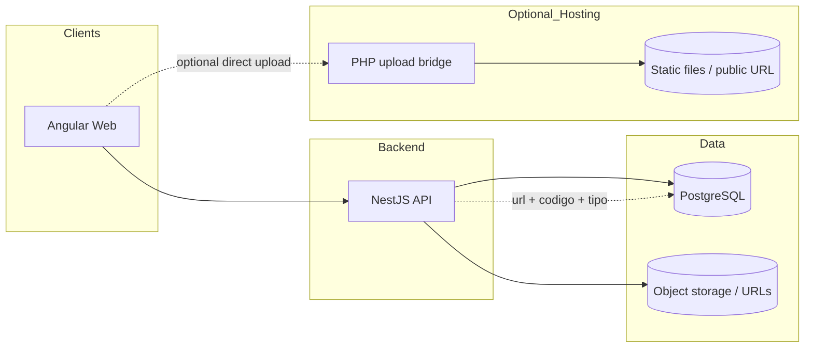

# Issue Tracking — Incidencias y condiciones inseguras

Aplicación web de **gestión de incidencias**, **actos y condiciones inseguras**, con **trazabilidad**, **evidencia fotográfica**, **responsables**, **estados** e **indicadores por rol**. Sustituye el flujo actual basado en Excel por un proceso ordenado: registro → asignación → seguimiento → cierre → reportes.

> **Stack:** **Angular** (frontend), **NestJS** (API REST), **PostgreSQL**. Las imágenes se referencian en base de datos (URL); el almacenamiento puede ser S3, Azure Blob, Cloudinary o volumen en MVP.  
> **Recepción de archivos en hosting compartido (GoDaddy):** carpeta `godaddy-php/` con `upload.php`. Configuración y secretos desde **`.env`** en la raíz; despliegue por **FTP** con `scripts/deploy-godaddy-php.ps1` o **GitHub Actions**. Las imágenes se guardan por **`codigo_incidencia`** y **`tipo_imagen`** (`report` / `closure`); Nest persiste URL + código + tipo en **`imagenes_incidencia`** (ver [godaddy-php/README.md](./godaddy-php/README.md)).

## Objetivo del sistema

Implementar una aplicación web para el registro, control y reporte de incidencias, actos inseguros, condiciones subestándar y acciones correctivas.

El sistema debe permitir:

- Registrar incidencias con evidencia fotográfica.
- Asignar responsables y líderes de área.
- Controlar estados de atención.
- Mostrar indicadores por líder, área, mes y estado.

El objetivo no es solo digitalizar una matriz, sino ordenar el proceso completo:

**Registro** → **Asignación de responsable** → **Seguimiento** → **Cambio de estado** → **Cierre** → **Reportes e indicadores**

## Problema actual (Excel)

- Duplicidad de información y dependencia de macros o fórmulas.
- Reportes manuales y baja trazabilidad.
- Difícil control de evidencias fotográficas.
- Falta de seguridad por usuario e indicadores poco confiables.
- Poca visibilidad de qué está abierto, en proceso o cerrado; poca visibilidad por líder o responsable.

## Alcance general — módulos

1. Autenticación y roles  
2. Dashboard general  
3. Panel de control por líder / mes  
4. Registro de incidencias  
5. Gestión de estados  
6. Gestión de evidencias fotográficas  
7. Gestión de usuarios  
8. Gestión de áreas / líderes / responsables  
9. Reportes e indicadores  
10. Exportación de información  
11. Auditoría y trazabilidad  

## Roles

### Administrador

Ve toda la información. Puede crear/editar/activar usuarios, asignar roles, áreas y líderes; ver dashboard general; CRUD de incidencias según reglas de negocio; cambiar estados; reportes y exportación.

### Líder de área

Ve información de su área o equipo: dashboard propio, incidencias asignadas, indicadores, abiertas / en proceso / cerradas; cambiar estado; registrar acciones correctivas; evidencia de cierre; reporte mensual del área.

### Operador / reportante

Registra incidencias: foto, ubicación, descripción, tipo (acto / condición), potencial de riesgo; consulta lo que registró y el estado de atención.

## Flujo funcional principal

### Registro de incidencia

Campos sugeridos: código, fecha, hora, año, mes, reportante, área, fundo/planta/sede, ubicación, tipo (acto / condición), condición o acto, potencial (bajo / medio / alto), descripción, medidas correctivas sugeridas, responsable, líder, estado inicial, imágenes, observaciones.

**Estado inicial sugerido:** Abierto.

### Evidencia fotográfica

- Una o varias imágenes por incidencia; miniatura y vista ampliada; reemplazo según permisos; imagen de cierre.
- Validación de tamaño máximo y formatos: JPG, PNG, WEBP.

### Estados

**Abierto** → **En proceso** → **Cerrado**

- **Abierto:** registrada, sin atención aún.  
- **En proceso:** el responsable inició acciones correctivas.  
- **Cerrado:** acción correctiva ejecutada y validada (fecha de cierre, usuario, comentario, evidencia de cierre).

### Dashboard general

Indicadores: abiertas, en proceso, cerradas, % cumplimiento, total del mes, por potencial. Gráficos sugeridos: por líder, cumplimiento por área, evolución mensual, por estado, por potencial, por tipo acto/condición. El administrador ve todo; el líder solo lo suyo.

### Panel de control

Filtros dinámicos: líder, área, mes, año, estado, potencial, tipo. Resultado: KPIs del líder, cumplimiento, conteos, listado filtrado, gráficos automáticos.

### Gestión de incidencias (tabla)

Columnas mínimas: fecha, área, ubicación, reportante, potencial, estado, responsable, líder, acciones (detalle, editar, estado, evidencia, eliminar si aplica). Filtros: estado, área, mes, año, responsable, potencial.

### Detalle de incidencia

Datos generales, reportante, ubicación, descripción, medidas, estado, responsable, imagen inicial y de cierre, historial de cambios, comentarios.

### Usuarios

Campos: nombre, correo, rol, área, líder asociado, activo/inactivo, acceso/contraseña. Roles: Administrador, Supervisor/Líder, Operador.

### Reportes

Por mes, año, líder, área, estado, potencial, tipo. Incluye reportes mensuales por líder, abiertas, en proceso, cerradas, cumplimiento por área y general, histórico anual. Exportación: Excel y PDF (el PDF sustituye la “hoja” tipo Excel).

### Indicadores mínimos

- % cumplimiento = cerradas / total registradas (según definición acordada).  
- Cantidades abiertas / en proceso / cerradas y total.  
- Desglose por líder, área, mes, potencial.

### Reglas de negocio sugeridas

- Incidencia con fecha, área, ubicación, descripción y potencial obligatorios.  
- Responsable asignado obligatorio.  
- Solo usuarios autorizados cierran incidencias.  
- Cierre con comentario; opcionalmente evidencia fotográfica obligatoria.  
- Líder solo ve su área; administrador ve todo.  
- No perder historial de cambios (auditoría).

## Arquitectura técnica

### Stack elegido

| Capa | Tecnología |
|------|------------|
| Frontend | Angular (responsive, escritorio y tablet) |
| Backend | NestJS, API REST, JWT, control de roles, validaciones centralizadas |
| Base de datos | PostgreSQL (recomendado) |
| Archivos | URLs en BD; objeto en S3 / Azure / Cloudinary / volumen MVP |

### Tablas principales (referencia)

`usuarios`, `roles`, `areas`, `lideres`, `incidencias`, `incident_responses` (evidencias/respuestas por estado con comentario), `audit_logs` (historial completo de cambios), `catalogos`.

> `incident_responses` reemplaza `imagenes_incidencia`. Cada respuesta lleva: `incidentCode`, `status` (estado al que pertenece), `imageType` (`report`|`closure`), `url`, `comment`, `uploadOk`, `uploadError`.

### Diagrama de contexto



### Bridge PHP (GoDaddy) y modelo `incident_responses`

Flujo recomendado: **Angular → NestJS** (JWT) → `POST /incident-images/upload` (multipart) → Nest reenvía al **PHP** con `codigo_incidencia`, `tipo_imagen` y cabecera `X-Upload-Token`. El PHP escribe `uploads/{codigo}/report_*.jpg` o `closure_*.jpg` y devuelve JSON. Nest persiste en **`incident_responses`**: `url`, `storagePath`, `incidentCode`, `status`, `imageType`, `comment`, `uploadOk`, `uploadError`.

**Si el PHP falla:** la incidencia se guarda igual; `uploadOk = false` y `uploadError` contiene el mensaje. El frontend muestra el aviso pero no bloquea el flujo.

Configuración por **`.env`** (ver [.env.example](./.env.example)); despliegue del PHP: **PowerShell** `./scripts/deploy-godaddy-php.ps1` o workflow [deploy-godaddy-php.yml](./.github/workflows/deploy-godaddy-php.yml).

Detalle de API del PHP y columnas sugeridas: [godaddy-php/README.md](./godaddy-php/README.md).

## MVP recomendado

- Login  
- Dashboard general  
- Registro de incidencia + subida de foto  
- Listado de incidencias  
- Cambio de estado  
- Gestión de usuarios  
- Filtros por líder / mes / estado  
- Reporte básico Excel o PDF  

## Usuarios de prueba

La semilla local crea usuarios para probar todos los roles. En Docker local se cargan con `SEED_ON_BOOT=true`.

| Rol | Correo | Contraseña | Alcance esperado |
|-----|--------|------------|------------------|
| Administrador | `admin@demo.local` | `demo1234` | Ve toda la operación |
| Líder demo | `lider@demo.local` | `demo1234` | Área `PACK`, líder `LUCIA` |
| Operador demo | `operador@demo.local` | `demo1234` | Área `FIELD`, líder `MARIO` |
| Líder Empaque | `lucia@demo.local` | `demo1234` | Área `PACK` |
| Líder Campo | `mario@demo.local` | `demo1234` | Área `FIELD` |
| Líder Planta | `rosa@demo.local` | `demo1234` | Área `PLANT` |
| Líder Logística | `manuel@demo.local` | `demo1234` | Área `LOG` |
| Líder Calidad | `diana@demo.local` | `demo1234` | Área `QA` |
| Auditor | `auditor@demo.local` | `demo1234` | Consulta / auditoría |

> Para ambientes reales cambia estas contraseñas desde la pantalla **Clave** del usuario y desactiva credenciales demo.

## GoDaddy / cPanel para imágenes

Para automatizar la subida de imágenes con el bridge PHP en GoDaddy se necesita:

- URL pública final del `upload.php`.
- Ruta interna de escritura dentro del hosting, por ejemplo `public_html/uploads`.
- Token secreto `X-Upload-Token`, igual en Nest y en PHP.
- Límite de tamaño permitido por cPanel/PHP (`upload_max_filesize`, `post_max_size`).
- Dominio o subdominio desde donde quedarán públicas las imágenes.
- Acceso FTP/SFTP o credenciales de GitHub Actions para desplegar `godaddy-php/`.
- Confirmar si cPanel permite escribir en la carpeta objetivo y si requiere permisos `755/775`.

## Fuera de alcance inicial (fase 2)

App móvil nativa, notificaciones WhatsApp, firma digital, flujos de aprobación complejos, integración ERP, IA, geolocalización avanzada, modo offline.

## Conclusión

El alcance correcto no es solo “registrar y mostrar datos”. El sistema debe cubrir registro, evidencia, responsable, seguimiento, estado, cierre, indicadores, reportes, seguridad por rol y trazabilidad: **control operativo** sobre incidencias y acciones correctivas.

---

## Repository layout

```text
issue-tracking/
├── apps/
│   ├── front/          # Angular 19 — portal (ver ARCHITECTURE.md)
│   └── back/           # NestJS 11 — API /api (ver ARCHITECTURE.md)
├── godaddy-php/        # PHP en GoDaddy: uploads por codigo_incidencia + tipo report|closure
├── scripts/            # deploy-godaddy-php.ps1
├── .github/workflows/  # deploy-godaddy-php.yml
├── infra/              # docker-compose (+ override opcional host-postgres)
├── docs/
├── .env.example        # GoDaddy FTP + secretos PHP (raíz)
└── README.md
```

## Docker (PostgreSQL + Nest + Angular)

1. `Copy-Item infra\.env.example infra\.env` y ajusta contraseñas si quieres.  
2. Desde la raíz del repo:

```powershell
docker compose -f infra/docker-compose.yml --env-file infra/.env up --build
```

- UI: http://localhost:8080 (`/api` → Nest vía nginx)  
- API directa (host): `http://localhost:3001/api/health` salvo que cambies `API_PORT` en `infra/.env`  
- Postgres: solo accesible entre contenedores; para exponerlo al host ver [infra/README.md](./infra/README.md)

Detalle: [infra/README.md](./infra/README.md).

## Deploy en Railway (API Nest + Postgres)

1. Crea un proyecto en Railway y agrega un servicio **Postgres**.
2. Agrega un servicio desde GitHub apuntando a este repo y configura **Root Directory** = `apps/back`.
3. Railway detecta `apps/back/railway.toml` y arranca con `npm run start:prod`.
4. En variables del servicio API configura:
   - `NODE_ENV=production`
   - `PORT=3000` (Railway inyecta su propio `PORT`; puedes dejar este valor como fallback)
   - `DATABASE_URL=${{Postgres.DATABASE_URL}}` (desde el servicio Postgres de Railway)
   - `TYPEORM_SYNC=false`
   - `SEED_ON_BOOT=false`
   - `CORS_ORIGIN=https://<tu-frontend>.up.railway.app,https://<tu-dominio>`
   - `GODADDY_PHP_UPLOAD_URL=https://proserla.com/proserla.com/issues-tracking/upload.php`
   - `GODADDY_UPLOAD_SECRET=<mismo valor de godaddy-php/config.php>`
5. Despliega y valida:
   - `https://<tu-api>.up.railway.app/api/health`
   - `https://<tu-api>.up.railway.app/api-docs`

Notas:
- El backend soporta `DATABASE_URL` (recomendado en Railway) y también variables separadas (`DATABASE_HOST`, `DATABASE_PORT`, etc.).
- Si usas Postgres gestionado por Railway, deja `DATABASE_SSL=false` al inicio; actívalo solo si tu endpoint lo exige.

## Documentación y siguientes pasos

| Tema | Notas |
|------|--------|
| API | OpenAPI/Swagger desde NestJS |
### Auditoría y trazabilidad

Cada operación de creación, actualización o eliminación sobre incidencias (y cualquier entidad que lo implemente) genera un registro en `audit_logs` con:

- `entityType` / `entityId`: qué objeto cambió.
- `action`: `create` | `update` | `delete`.
- `changeLabel` + `previousValue` + `nextValue`: resumen del cambio principal (ej. `status: open → in_progress`).
- `changedBy`: email del usuario que realizó el cambio (desde header `x-user-email`).
- `previousSnapshot`: objeto completo antes del cambio (JSON).
- `diff`: solo los campos que cambiaron `{ campo: { from, to } }` (JSON).

La pantalla `/auditoria` (solo admin) muestra la lista con cambio + fecha y permite expandir el detalle con el diff y el snapshot anterior.
| Archivos | Política de tamaño, virus scan si aplica, CDN opcional |

## Changelog

| Fecha | Nota |
|-------|------|
| 2026-04-24 | README inicial; `godaddy-php/` + despliegue `.env` / FTP / GHA; rutas por código y tipo |
| 2026-04-25 | Scaffold `apps/front` (Angular), `apps/back` (Nest + TypeORM + Postgres), `infra/` Docker Compose |
| 2026-04-25 | **Auditoría y trazabilidad** (`audit_logs`): snapshot anterior + diff JSON por cada cambio en cualquier entidad. Pantalla `/auditoria` (solo admin) con lista (cambio + fecha) y detalle expandible. |
| 2026-04-25 | **Respuestas por estado** (`incident_responses`): reemplaza `incident_images`. Cada imagen/respuesta lleva `status`, `comment`, `uploadOk` y `uploadError`. Múltiples respuestas por estado. |
| 2026-04-25 | **Upload PHP bridge integrado**: endpoint `POST /incident-images/upload` en Nest recibe el archivo, lo reenvía al PHP de GoDaddy y persiste el resultado. Si el PHP falla, la incidencia se guarda igual y el error queda en `uploadError`. |
| 2026-04-25 | **KPIs por rol**: dashboard y reportes aplican scope automático desde headers `x-role-code / x-area-code / x-leader-code`. Líder solo ve su área; admin ve todo. |
| 2026-04-25 | **Header `x-user-email`** añadido al interceptor HTTP del frontend para trazabilidad de auditoría. |
